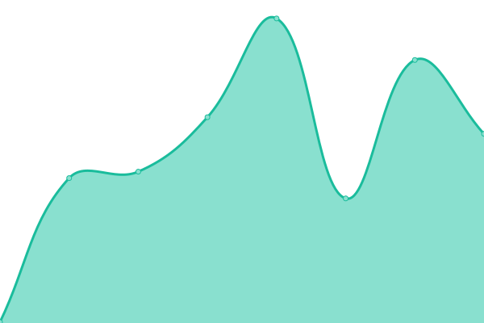
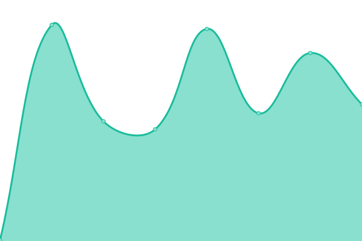
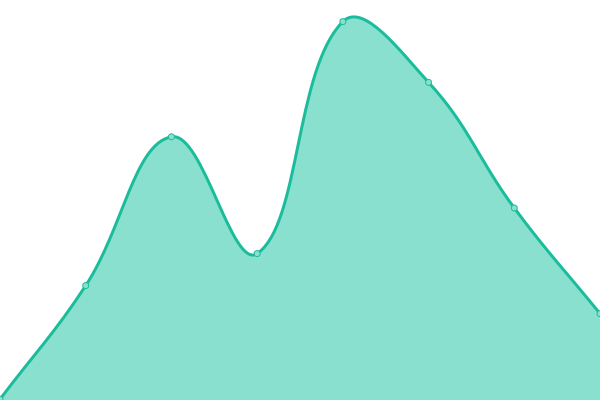

# [📈 Live Status](https://radquincy.github.io/radquincy-upptime): <!--live status--> **🟩 All systems operational**

This repository contains the open-source uptime monitor and status page for [Rad_Quincy](https://radquincy.com/), powered by [Upptime](https://github.com/upptime/upptime).

With [Upptime](https://upptime.js.org), you can get your own unlimited and free uptime monitor and status page, powered entirely by a GitHub repository. We use [Issues](https://github.com/radquincy/radquincy-upptime/issues) as incident reports, [Actions](https://github.com/radquincy/radquincy-upptime/actions) as uptime monitors, and [Pages](https://radquincy.github.io/radquincy-upptime) for the status page.

<!--start: status pages-->
<!-- This summary is generated by Upptime (https://github.com/upptime/upptime) -->
<!-- Do not edit this manually, your changes will be overwritten -->
<!-- prettier-ignore -->
| URL | Status | History | Response Time | Uptime |
| --- | ------ | ------- | ------------- | ------ |
|  [RadQuincy.com](https://radquincy.com/) | 🟩 Up | [rad-quincy-com.yml](https://github.com/radquincy/radquincy-upptime/commits/HEAD/history/rad-quincy-com.yml) | 

 187ms
     
 | 

<a href="https://radquincy.github.io/radquincy-upptime/history/rad-quincy-com">100.00%</a>
    

|  [RadGames](https://radgames.radquincy.com/) | 🟩 Up | [rad-games.yml](https://github.com/radquincy/radquincy-upptime/commits/HEAD/history/rad-games.yml) | 

 189ms
     
 | 

<a href="https://radquincy.github.io/radquincy-upptime/history/rad-games">100.00%</a>
    

|  [Deakin University Computer Society (DUCS)](https://ducs.club/) | 🟩 Up | [deakin-university-computer-society-ducs.yml](https://github.com/radquincy/radquincy-upptime/commits/HEAD/history/deakin-university-computer-society-ducs.yml) | 

 222ms
     
 | 

<a href="https://radquincy.github.io/radquincy-upptime/history/deakin-university-computer-society-ducs">100.00%</a>
    

<!--end: status pages-->

[**Visit our status website →**](https://radquincy.github.io/radquincy-upptime)

## 📄 License

- Powered by: [Upptime](https://github.com/upptime/upptime)
- Code: [MIT](./LICENSE) © [Anand Chowdhary](https://anandchowdhary.com), supported by [Pabio](https://pabio.com)
- Data in the `./history` directory: [Open Database License](https://opendatacommons.org/licenses/odbl/1-0/)
